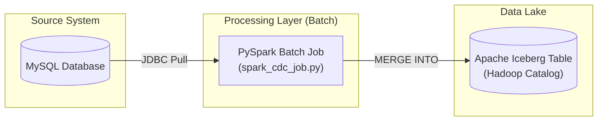
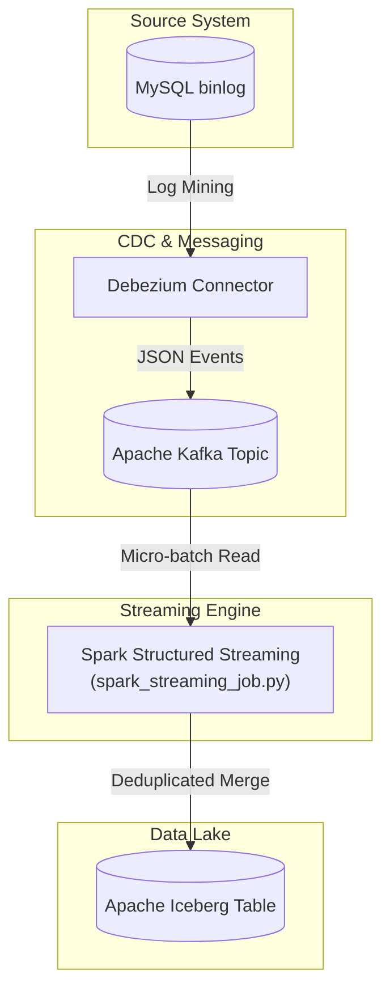

# CDC Pipeline Architecture

This document provides a technical overview of the two data synchronization patterns implemented: **Batch CDC** and **Real-Time Streaming CDC**.

## 1. Overall System Components

- **Source**: MySQL Database (Local Docker instance)
- **CDC Engine**: Debezium (for Streaming) / PySpark JDBC (for Batch)
- **Message Broker**: Apache Kafka (Streaming only)
- **Processing Engine**: Apache Spark (PySpark)
- **Destination**: Apache Iceberg (Data Lake Table Format)

---

## 2. Batch CDC Architecture

The batch pipeline is designed for periodic synchronization (e.g., daily). It reads the entire source table or a delta via JDBC and reconciles the state in Iceberg.

### Batch Data Flow:
1. **Extraction**: Spark connects to MySQL using a JDBC driver.
2. **Transformation**: The data is loaded into a Spark DataFrame.
3. **Reconciliation**: A `MERGE INTO` SQL statement compares the source data with the Iceberg table.
4. **Final State**: Records are Inserted, Updated, or Deleted (Soft Delete) in the Iceberg table based on the primary key match.

---

## 3. Streaming CDC Architecture (Real-Time)

The streaming pipeline captures changes as they happen in the MySQL transaction log (binlog) and propagates them to Iceberg with sub-second latency.

### Streaming Data Flow:
1. **Capture**: Debezium monitors MySQL binlogs and creates an event for every Row-Level Change (Insert/Update/Delete).
2. **Transport**: Events are published to a Kafka topic.
3. **Stream Processing**: Spark Structured Streaming subscribes to the Kafka topic.
4. **Micro-batching**: Every few seconds, Spark processes a batch of events, deduplicates them (keeping only the latest version of a record), and executes a `MERGE INTO` command on the Iceberg table.

---

## 4. Key Differences

| Feature | Batch Pipeline | Streaming Pipeline |
| :--- | :--- | :--- |
| **Latency** | High (Minutes/Hours) | Low (Seconds) |
| **Source Impact** | High (Heavy Querying) | Low (Log Reading) |
| **Complexity** | Low | High (Requires Kafka/Debezium) |
| **Reliability** | Atomic Table Swaps/Merges | Checkpoint-based exactly-once |
